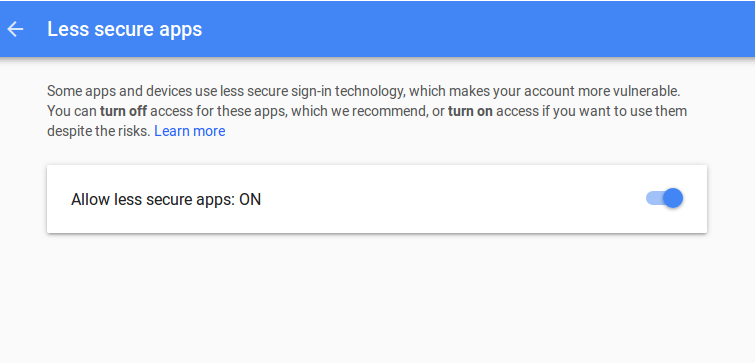
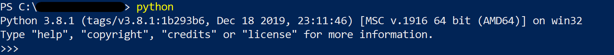

# CVS_Vaccine_Finder

## How It Works

This program checks the CVS website at a set interval (set by default at once per minute) for vaccine appointment availability. 
Anytime a new available appointment is detected, the program automatically sends an email to alert the user.

The user must enter information about an sending/receiving emails as well as information pertaining to where to search for appointments.

There are two parts to making the code work, both outlined below. First is the user input section, and second is the running the code section.

## Input Explanation

Open the `cvs_check.py` file.
In Windows, right-click on the file and hover over the Open with option. Select Notepad or a text editor specifically for code.
Mac users double click the file.

Once in your text editor scroll until you see "HERE!" in all caps.
Below the HERE marker you will be inputting information regarding which states and/or cities you would like to receive alerts about, as well as relevant email information.

**Email Information Input** 
You will be asked to input a provider (such as gmail, outlook, comcast, etc), an email from which to send alerts, the password to the sender email account, and an email from which to receive alerts.
 Example input: 
`EMAIL_PROVIDER = 'gmail'` 
`SENDER = "example@provider.com"` 
`PASSWORD = "yourpassword"` 
`RECEIVER = "example@example.com"` 

If using gmail, you will have to lower security on the sender account in order to allow the program to automatically send emails.  We aren't hacking you ... promise.
In order to lower security, log into the sender email, go to https://www.google.com/settings/security/lesssecureapps and turn the button on as shown below:

**State and City Input** 
There are three acceptable formats of input:
1. Enter one or multiple states and leave the CITIES array empty (i.e. `CITIES = []`)
2. Enter one state, and list out multiple cities that are all in that one state.
3. Enter multiple states in multiple cites. In this third case, each city MUST have its matching state listed out in the exact same order. 
For example, if you would like to check only in Hudson New York, Medford Massachusetts, Ocean City Maryland, and Salem Massachusetts, input would be as follows: 
`STATEINI = ['NY', 'MA', 'MD', 'MA', 'TX']` 
`CITIES = ['Hudson', 'Medford', 'Ocean City', 'Salem', 'Bee Cave']` 
Note that you must have MA twice to match with its analagous city, in order. 

You will eventually see a "STOP" after which you should make no changes to the code in order to ensure functionality.

Save the code and run.

## Running the Code

### STEP 0
Download project files.

### STEP 1
Windows Users-  
Launch the Powershell application

Mac Users-  
Open the default terminal (search for terminal) and skip to step 4

### STEP 2
Type python and hit enter. If you do not have python, it will lauch the Microsoft store and install  
Note: Be sure to check the add to PATH option if installing

### STEP 3
If you type python and hit enter again, or if you already have python on your machine, the three arrows `>>>` should show up like below:

Type `exit()` and hit enter to exit out of the three arrows

### STEP 4 
Navigate into folder containing the project files (likely Downloads).
If you are unfamiliar with how to do this, look here:
https://www.groovypost.com/howto/open-command-window-terminal-window-specific-folder-windows-mac-linux/  
Note: for windows users, the website shows for the actual command terminal but we recommend powershell (All the commands are the same)

### STEP 5
Run the code: type `python cvs_check.py` and then hit `enter`.

The code will "print" out a status update every minute, but will only send an email if there are new appointments available.

The code will "run" (i.e. work to check the CVS website) on your machine until it is cancelled. This can be done by hitting Ctrl-C (or Command-C if Mac) in the powershell/terminal. By putting your computer to sleep or shutting it down, the code will also terminate.

To run the code again after cancelling it, type `python cvs_check.py` and then hit `enter`.

NOTE: Any changes made to the code will not be reflected in an already-running process. In order for changes to take effect, you must cancel the currently running code, save the updated input changes, and run it again.

### STEP 6
Good luck!
